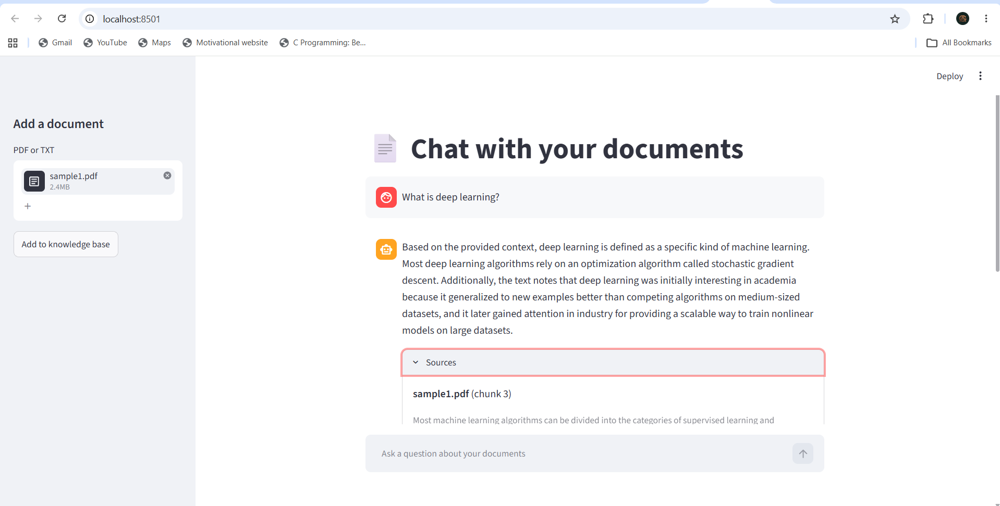
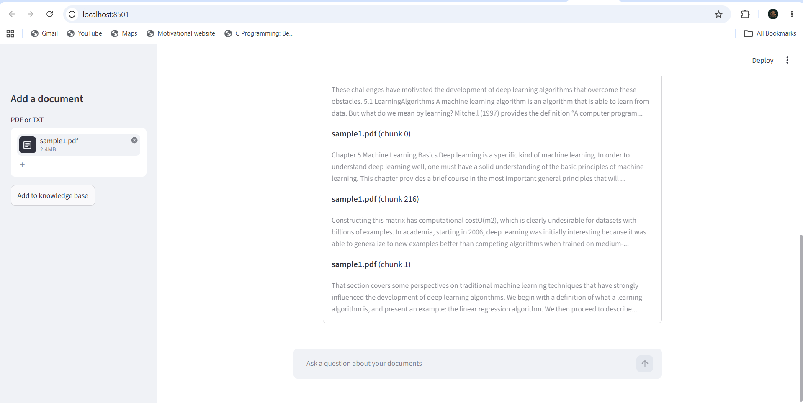

# RAG Project: Chat with Your Documents

A Retrieval-Augmented Generation (RAG) app that answers questions from your own PDF and TXT files, and shows the exact passages it used.




## How it works

1. **Load**: reads PDF/TXT files from `data/` and cleans the text
2. **Chunk**: splits the text into sentence-based chunks
3. **Embed**: converts chunks to vectors with `all-MiniLM-L6-v2` (sentence-transformers)
4. **Store**: saves vectors in a local ChromaDB database
5. **Retrieve**: finds the 6 chunks closest in meaning to the question
6. **Generate**: sends those chunks and the question to Google Gemini, which answers only from that context

## Tech stack

Python, sentence-transformers, ChromaDB, Google Gemini API, Streamlit, pypdf

## Setup

```bash
git clone https://github.com/ajay8402/RAG_Project.git
cd RAG_Project
python -m venv .venv
.venv\Scripts\activate        # Windows
# source .venv/bin/activate   # Mac/Linux
pip install -r requirements.txt
```

Create a `.env` file (copy `.env.example`) and add a free key from [Google AI Studio](https://aistudio.google.com):

```
GEMINI_API_KEY=your-key-here
```

## Run

1. Put your PDF/TXT files in a `data/` folder
2. Index them: `python ingest.py`
3. Start the web app: `streamlit run app.py`

You can also upload documents from the app's sidebar, or chat in the terminal with `python main.py`.

## Project structure

```
RAG_Project/
├── app.py            # Streamlit web interface
├── main.py           # Terminal chat
├── ingest.py         # Index documents into ChromaDB
├── src/
│   ├── loader.py     # Read PDF/TXT files
│   ├── cleaner.py    # Fix PDF text issues
│   ├── chunker.py    # Sentence-based chunking
│   ├── vectorstore.py# Embeddings + ChromaDB search
│   └── generator.py  # Gemini answer generation
└── docs/screenshot.png
```

## Limitations and ideas

- Each question is answered independently (no chat memory)
- Scanned PDFs without selectable text are not supported
- Possible next steps: similarity cutoff, conversation memory, reranking, deployment